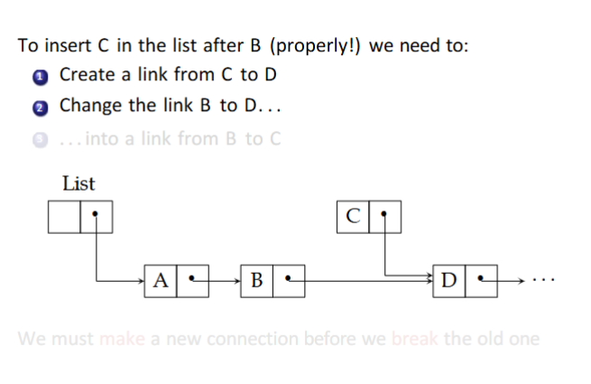
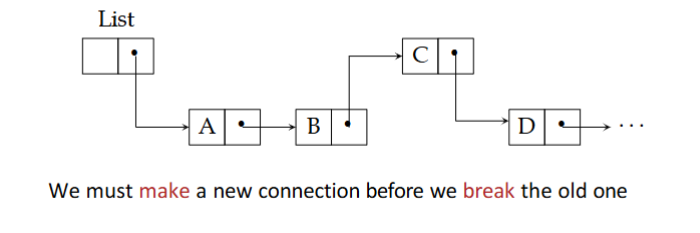
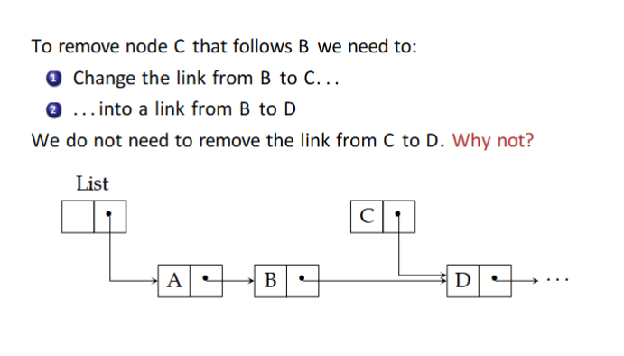
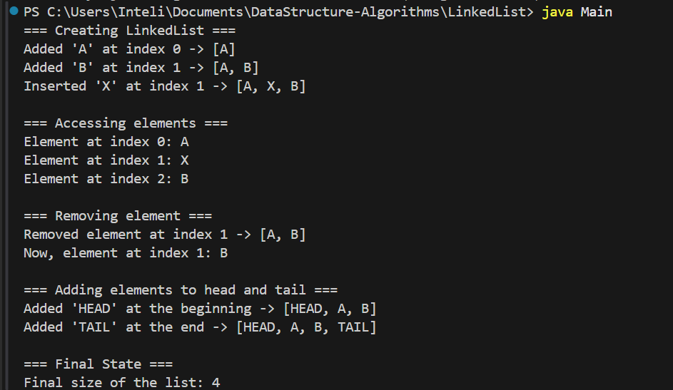

# Linked List

A linked list is a fundamental computer science data structure that represents a sequence of data elements called nodes, connected by pointers to form a chain.

This repo shows a practical whey of building a Linked List with implemented methods as `add`, `get`, `remove` and `size`.

## About Linked Lists

- Good for adding or removing in the middle of the list (just need to move pointers);
- Bad for index searching (must go node by node);
- Each node contains the data and the pointer.

## About this repo

I'm using `Java` for this exercise. 

There's a file called `Node.java` witch has the structure and behaviors of a node: 
- {data} `getData`, `setData`,
- {pointers} `getNext` and `setNext`.

The file `LinkedList.java` implements the final objective of this exercise: behavior of linked lists such as `add`, `get`, `remove` and `size` methods.

To test everything, the `Main.java` archive operates the linked list.

There's also an `HelloWord.java` file to make sure that the environment is working as expected.

### `Add`

To add an object in the linked list, it is needed to follow this sequence:

1. Get the node of `index - 1` (for the node that os about to be inserted be aware of where to direct it's pointer);
2. Set the pointer of the new node as the same of `index -1`;
3. Set the pointer of the node before (`index-1`) to point towards the new object/node that's being inserted.




### `get`

To get an object of the linked list, it is needed to walk through the list node by node until getting in the index desired.

### `remove`

To remove an item of the linked list , it is needed to follow these steps:

1. Walk through the list until the node before than the one being deleted - important to manipulate it's pointer;
2. Get the next node (`index+1);
4. Set the `index-1` pointer to point at the `index+1` node.



### `size`

Returns the list size. Simple like that because the list size is a global variable at the class always being updated on each method.

## Results

The test code in the `Main.java` archive is:

```java
public class Main {
    public static void main(String[] args) {
        LinkedList list = new LinkedList();

        list.add("A", 0);
        list.add("B", 1);
        list.add("X", 1);
        System.out.println(list.get(0)); // A
        System.out.println(list.get(1)); // X
        System.out.println(list.get(2)); // B

        list.remove(1); // remove X
        System.out.println(list.get(1)); // B

        list.add("HEAD", 0);
        list.add("TAIL", list.size());
        System.out.println("Size: " + list.size());
    }
}
```

The result indicates that it worked efficiently:

