# Coursework Assessment

## Kaiane Souza Cordeiro
## UB N° - 25029204

**Data Structures and Algorithms**
**COS5021-B**

Nov/Dec 2025

---

# Task 01: Stack–Queue Algorithm Trace

### Algorithm:

```java
while (!stack.isEmpty()) {
    int x = stack.pop();
    if (x < 20) {
        queue.enqueue(x * 2);
    } else {
        stack.push(x - 5);
    }
}
```

### Initial state:
- Stack (top → bottom): [30, 15, 25, 10]
- Queue (front → rear): []

### Trace Table:

| Step  | Operation                  | Stack After Step     | Queue After Step     | Explanation                               |
| ----- | -------------------------- | -------------------- | -------------------- | ----------------------------------------- |
| **1** | pop → x = 30 → push(25)    | **[25, 15, 25, 10]** | **[]**               | 30 > 20 → push 30−5 = 25                  |
| **2** | pop → x = 25 → push(20)    | **[20, 15, 25, 10]** | **[]**               | 25 > 20 → push 25−5 = 20                  |
| **3** | pop → x = 20 → push(15)    | **[15, 15, 25, 10]** | **[]**               | 20 = 20 (still not less than 20) → push 20−5 = 15                  |
| **4** | pop → x = 15 → enqueue(30) | **[15, 25, 10]**     | **[30]**             | 15 < 20 → enqueue 15×2 = 30               |
| **5** | pop → x = 15 → enqueue(30) | **[25, 10]**         | **[30, 30]**         | 15 < 20 → enqueue 30                      |
| **6** | pop → x = 25 → push(20)    | **[20, 10]**         | **[30, 30]**         | 25 > 20 → push 20                         |
| **7** | pop → x = 20 → push(15)    | **[15, 10]**         | **[30, 30]**         | 20 = 20 (still not less than 20) → push 15                         |
| **8** | pop → x = 15 → enqueue(30) | **[10]**             | **[30, 30, 30]**     | 15 < 20 → enqueue 30                      |
| **9** | pop → x = 10 → enqueue(20) | **[]**               | **[30, 30, 30, 20]** | 10 < 20 → enqueue 20. Stack empty → stop. |

### Final state:
• Stack: []
• Queue: [30, 30, 30, 20]

### Explanation - what is happening and why that change occurs:
The algorithm processes elements from the stack until it is empty. For each element popped from the stack, if it is less than 20, it is doubled and added to the queue. If it is 20 or greater, 5 is subtracted from it and pushed back onto the stack. This continues until all elements have been processed, resulting in an empty stack and a queue containing the doubled values of all elements that were less than 20 :).

### Efficiency Analysis - Task 1 :
#### **Time Complexity**

The algorithm repeatedly subtracts 5 from any value `x ≥ 20` and pushes it back onto the stack. A value of size `x` may go through this process about `x/5` times before it becomes less than 20. Therefore, processing one value takes **O(x)** time.

If the stack has **n** values and the largest one is **M**, the worst-case total time is:

$O(nM)$

#### **Space Complexity**

The algorithm only uses a stack, a queue, and one temporary variable. Together, they can hold at most all `n` elements.

$O(n)$

---

# Task 02:  Binary Search Tree — Deletion and Structural Reasoning

### a) BST Insertion Trace

> Insertion maintain the BST property by placing smaller keys to the left and larger keys to the right. For each insertion, I have compared the key to be inserted with the current node's key and decide to go left or right until I finded an appropriate null position.

| Step | Key Inserted | BST After Insertion                | Explanation                                                                 |
|------|--------------|------------------------------------|-----------------------------------------------------------------------------|
| 1    | 40           | 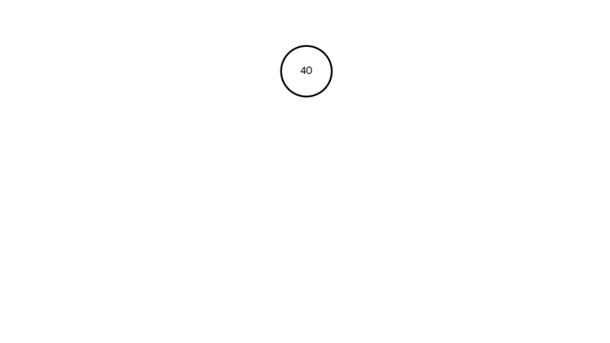     | Tree was empty, so 40 becomes the root node.                               |
| 2    | 25           | 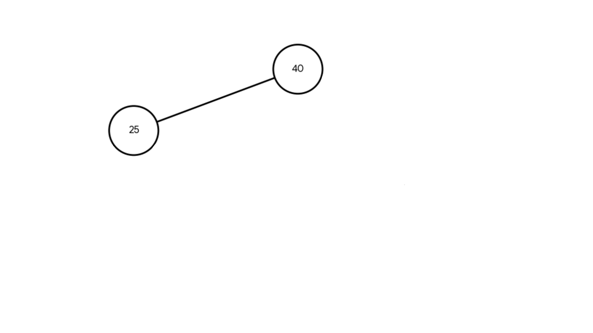     | 25 < 40, so it is inserted as the left child of 40.                        |
| 3    | 60           | 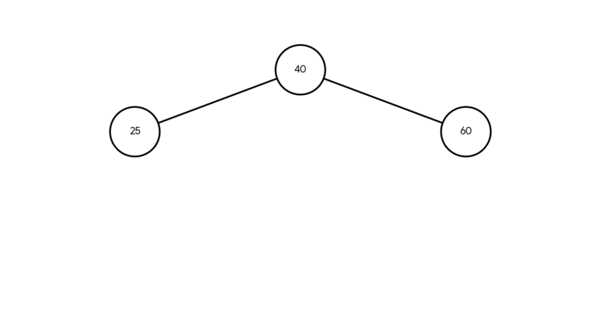     | 60 > 40, so it is inserted as the right child of 40.                       |
| 4    | 10           | 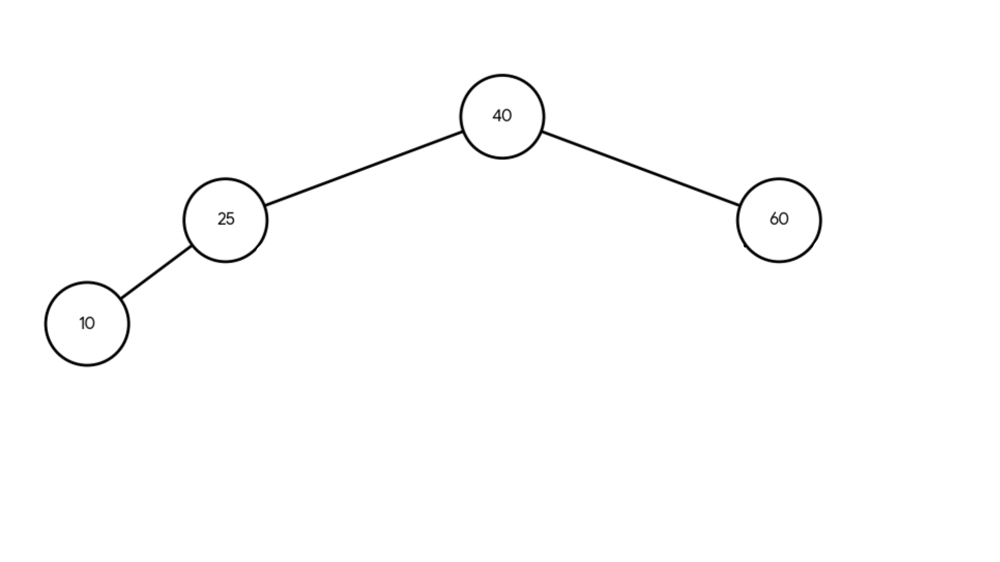     | 10 < 40 → go left; 10 < 25 → go left again; inserted as left child of 25.  |
| 5    | 30           | 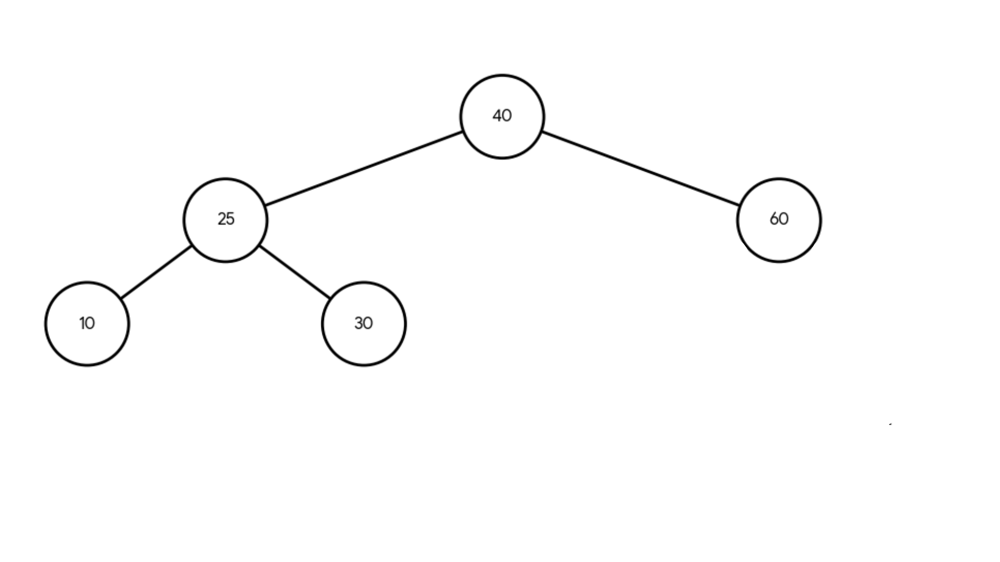     | 30 < 40 → go left; 30 > 25 → go right; inserted as right child of 25.      |
| 6    | 50           |      | 50 > 40 → go right; 50 < 60 → go left; inserted as left child of 60.       |
| 7    | 70           | 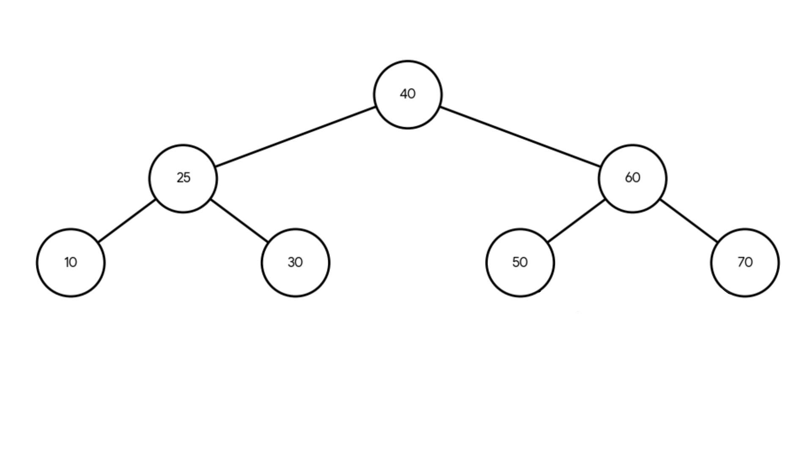     | 70 > 40 → right; 70 > 60 → right; inserted as right child of 60.           |
| 8    | 55           | 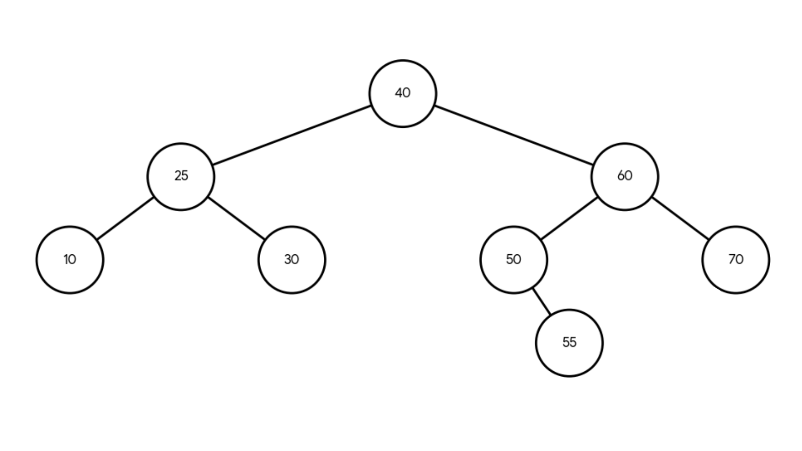     | 55 > 40 → right; 55 < 60 → left; 55 > 50 → right; inserted as right child of 50. |
| 9    | 65           | 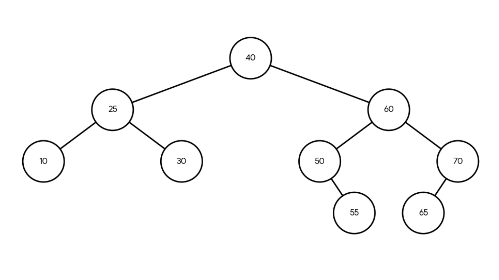     | 65 > 40 → right; 65 > 60 → right; 65 < 70 → left; inserted as left child of 70.  |

### b) Final BST With All Nodes Inserted
 

### c) Node Annotations (Height + Number of Children)
- Height definition: Distance from a node up to the furthest leaf.
Leaf nodes → height = 0

| Node   | Height | Children Count | Explanation       |
| ------ | ------ | -------------- | ----------------- |
| **10** | 0      | 0              | Leaf              |
| **30** | 0      | 0              | Leaf              |
| **55** | 0      | 0              | Leaf              |
| **65** | 0      | 0              | Leaf              |
| **25** | 1      | 2              | Children = 10, 30 |
| **50** | 1      | 1              | Only child = 55   |
| **70** | 1      | 1              | Only child = 65   |
| **60** | 2      | 2              | Children = 50, 70 |
| **40** | 3      | 2              | Children = 25, 60 |

### d) In-Order Traversal 
(Left → Node → Right)

The in-order traversal in BST produces sorted order of elements!

Step-by-step explanation

1. Visit **left subtree of 40**
2. Visit **left subtree of 25 → 10**
3. Visit **25**
4. Visit **right subtree of 25 → 30**
5. Visit **40**
6. Visit **left subtree of 60 → 50 → 55**
7. Visit **60**
8. Visit **right subtree of 60 → 70 → 65**

### **Final In-Order Output**

$[10, 25, 30, 40, 50, 55, 60, 65, 70]$


### e) Pre-Order Traversal
(Node → Left → Right) (Top-down approach)

Step-by-step explanation
1. Visit **40**
2. Visit **left subtree of 40 → 25**
3. Visit **left subtree of 25 → 10**
4. Visit **right subtree of 25 → 30**
5. Visit **right subtree of 40 → 60**
6. Visit **left subtree of 60 → 50 → 55**
7. Visit **right subtree of 60 → 70 → 65**

#### **Final Pre-Order Output**
$[40, 25, 10, 30, 60, 50, 55, 70, 65]$

### f) Delete Node = 60

To delete a node with two children (like 60), I find its in-order successor (the smallest node in its right subtree), which is 65. I replace 60 with 65 and then delete the original 65 node.

#### Step by step explanation:

Node 60 has two children → Case 3.

1. Find the in-order successor
   * Successor = smallest value in right subtree
   * Right subtree of 60 = {70, 65}
   * Smallest = 65
2. Replace 60 with 65
3. Delete the original node 65 from the right subtree (case 1: leaf node)

### Before deletion:


### After replacement of 60 with 65:


### After removing the original 65:

Final tree after deletion:


### Efficiency Analysis - Task 2:

The cost of BST operations depends on the tree height (h).

* **Search & Insertion — $O(h)$**
  Move down one branch from the root to a leaf.
  In a balanced tree, $h \approx \log n$.
  In the worst case (skewed), $h = n$.
  For this tree, $n=9$ and $h=3$, so operations behave close to $O(\log n)$.

* **Deletion — $O(h)$**
  Deleting 60 required finding the node, finding the successor, and removing it.
  All of this follows at most one or two downward paths → still $O(h)$.
  With this height 3 tree, this is effectively logarithmic.

* **Traversals — $\Theta(n)$**
  In-order and pre-order visit each node exactly once, so they always take linear time.

**Summary:**
Search, insertion, and deletion run in $O(h)$, which is $O(\log n)$ for balanced trees and $O(n)$ in the worst case. Traversals always run in $\Theta(n)$.

---

# Task 03: Dijkstra's algorithm

The Dijkstra's algorithm finds the shortest path from a starting node to all other nodes in a weighted graph with non-negative edge weights.

I am using set S to track visited nodes with known shortest distances, and set Q for unvisited nodes with tentative distances.

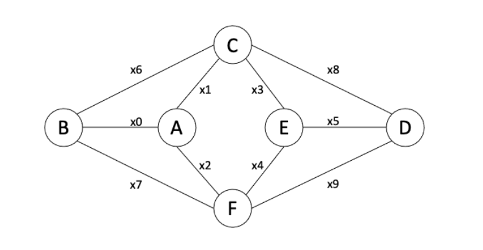

The edge weights are given by:

**Key = [74,7,84,90,94,81,99,48,17,36]**

x0 = 74   (A–B)
x1 = 7    (A–C)
x2 = 84   (A–F)
x3 = 90   (C–E)
x4 = 94   (F–E)
x5 = 81   (D–E)
x6 = 99   (C–B)
x7 = 48   (B–F)
x8 = 17   (C–D)
x9 = 36   (D–F)

## STEP 1: Visit A

| Node  | Distance | Visited? | Predecessor |
| ----- | -------- | --------- | ----------- |
| A | 0    | Yes       | –           |
| B     | 74       | No       | A           |
| C     | 7       | No       | A           |
| D     | ∞        | No       | –           |
| E     | ∞        | No       | –           |
| F     |84        | No       | A           |

**From A (distance 0):**
- B: new = 0 + 74 = 74 → update
- C: new = 0 + 7 = 7 → update
- F: new = 0 + 84 = 84 → update
- D, E: no direct edges → ignored

**Sets**
- S = { A(0) }
- Q = { C(7), B(74), F(84), D(∞), E(∞) }

## STEP 2: Visit C

- The distances are updated based on the neighbors of C. The new values are calculated from the distance to C (7) plus the edge weights to its neighbors. Weights bigger than the current known distances are ignored (as node B).

**From C (distance 7):**
- D:
    old = ∞
    new = 7 + 17 = 24 → update
- E:
    old = ∞
    new = 7 + 90 = 97 → update
- B:
    old = 74
    new = 7 + 99 = 106
    → 106 > 74 → no update

| Node  | Distance | Visited? | Predecessor |
|-------|----------|----------|-------------|
| A     | 0        | Yes      | –           |
| B     | 74       | No       | A           |
| C     | 7        | Yes      | A           |
| D     | 24       | No       | C           |
| E     | 97       | No       | C           |
| F     | 84       | No       | A           |

**Sets**
- S = { A(0), C(7) }
- Q = { B(74), F(84), D(24), E(97) }

## STEP 3: Visit D

- The distances are updated based on the neighbors of D. The new values are calculated from the distance to D (24) plus the edge weights to its neighbors. Weights bigger than the current known distances are ignored (as node E). 

**From D (distance 24):**
- F:
    old = 84
    new = 24 + 36 = 60 → update
- E:
    old = 97
    new = 24 + 81 = 105
    → 105 > 97 → no update

| Node  | Distance | Visited? | Predecessor |
|-------|----------|----------|-------------|
| A     | 0        | Yes      | –           |
| B     | 74       | No       | A           |
| C     | 7        | Yes      | A           |
| D     | 24       | Yes      | C           |
| E     |  97      | No       | C           |
| F     |  60      | No       | D           |

**Sets**
- S = { A(0), C(7), D(24) }
- Q = { B(74), F(84), E(97) }

## STEP 4: Visit F

**From F (distance 60):**
- B:
    old = 74
    new = 60 + 48 = 108
    → 108 > 74 → no update
- E:
    old = 97
    new = 60 + 94 = 154
    → 154 > 97 → no update

| Node  | Distance | Visited? | Predecessor |
|-------|----------|----------|-------------|
| A     | 0        | Yes      | –           |
| B     | 74       | No       | A           |
| C     | 7        | Yes      | A           |
| D     | 24       | Yes      | C           |
| E     |  97      | No       | C           |
| F     |  60      | Yes      | D           |

**Sets**
- S = { A(0), C(7), D(24), F(60) }
- Q = { B(74), E(97) }

## STEP 5: Visit B

**From B (distance 74):**
- No updates to neighbors (F already visited). 

| Node  | Distance | Visited? | Predecessor |
|-------|----------|----------|-------------|
| A     | 0        | Yes      | –           |
| B     | 74       | Yes      | A           |
| C     | 7        | Yes      | A           |
| D     | 24       | Yes      | C           |
| E     |  97      | No       | C           |
| F     |  60      | Yes      | D           |

**Sets**
- S = { A(0), C(7), D(24), F(60), B(74) }
- Q = { E(97) }

## STEP 6: Visit E

**From E (distance 97):**
- No updates to neighbors.

| Node  | Distance | Visited? | Predecessor |
|-------|----------|----------|-------------|
| A     | 0        | Yes      | –           |
| B     | 74       | Yes      | A           |
| C     | 7        | Yes      | A           |
| D     | 24       | Yes      | C           |
| E     |  97      | Yes      | C           |
| F     |  60      | Yes      | D           |

**Sets**
- S = { A(0), C(7), D(24), F(60), B(74), E(97) }
- Q = { }

### Final Shortest Paths from A:
| Target node | Minimum distance | Shortest path |
| ----------- | ---------------- | ------------- |
| A           | 0                | A             |
| B           | 74               | A → B         |
| C           | 7                | A → C         |
| D           | 24               | A → C → D     |
| E           | 97               | A → C → E     |
| F           | 60               | A → C → D → F |

### Efficiency Analysis - Task 3:
#### **Time Complexity**
In this assignment, Dijkstra’s algorithm is carried out using tables and a simple linear scan to choose the next smallest tentative distance. Since at each step it may be needed to check up to V nodes, and repeat this process for all V nodes, the total running time becomes:

$O(V^2)$

This is the standard complexity for the basic (non-optimized) version of Dijkstra.

If the algorithm is implemented with a priority queue (e.g., a binary heap), selecting and updating the minimum becomes faster, and the running time improves to:

$O((V + E)\log V)$

#### **Space Complexity**
When storing the graph using adjacency lists, the memory required includes:

- the graph itself (all nodes and edges) → O(V + E);
- one distance value for each node → O(V);
- one predecessor for each node → O(V);
- a visited marker for each node → O(V);

All of these grow linearly with the size of the graph, so the total space required is:

$O(V + E)$

---

# Task 4: Hash Table

The hash table has a size of 11 slots (0 to 10) and uses open addressing with double hashing for collision resolution.

**{key : [22, 12, 13, 24, 14, 16, 27, 20, 31, 10]}**

**Primary hash function:** $h1(x) = x \mod 11$

**Secondary hash function:** $h2(x) = (x \mod 3) + 1$

### a) Insertion Trace Table (for my own understanding)

| Step | Key | h1(x) | Initial Index | Collision? | h2(x) | Inserted Index | Explanation                                                  |
|------|-----|-------|---------------|------------|-------|--------------|--------------------------------------------------------------|
| 1    | 22  | 0     | 0             | No         | --    | 0            | P0 - Inserted at index 0                                          |
| 2    | 12  | 1     | 1             | No         | --    | 1            | P1 - Inserted at index 1                                          |
| 3    | 13  | 2     | 2             | No         | --    | 2            | P2 - Inserted at index 2                                          |
| 4    | 24  | 2     | 2             | Yes        | 1     | 3            | (P2) Collision at 2; (2nd attempt → 2 + 1) P3 → inserted at index 3     |
| 5    | 14  | 3     | 3             | Yes        | 3     | 6            | (P3) Collision at 3; (2nd attempt → 3 + 3) P6 → inserted at index 6     |
| 6    | 16  | 5     | 5             | No         | --    | 5            | P5 - Inserted at index 5                                          |
| 7    | 27  | 5     | 5             | Yes        | 1     | 7            | (P5) Collision at 5; (2nd attempt → 5+1) P6 (occupied), then (3rd attempt → 6+1) P7 → inserted at index 7      |
| 8    | 20  | 9     | 9             | No         | --    | 9            | P9 - Inserted at index 9                                          |
| 9    | 31  | 9     | 9             | Yes        | 2     | 4            | (P9) Collisions at 9, (2nd attempt → 9+2 → wrap around to index 0 → P0 → occupied), (3rd attempt - 0+2) P2 (occupied); (4th attempt - 2+2) P4 → inserted at index 4  |
| 10   | 10  | 10    | 10            | No         | --    | 10           | P10 - Inserted at index 10                                         |

### b) Final Hash Table State
| Bucket | 0  | 1  | 2  | 3  | 4  | 5  | 6  | 7  | 8 | 9  | 10 |
| ------ | -- | -- | -- | -- | -- | -- | -- | -- | - | -- | -- |
| Value  | 22 | 12 | 13 | 24 | 31 | 16 | 14 | 27 | — | 20 | 10 |


### c) Hash Table trace 1

Hash Table trace 1
P0
I22@0
P1
I12@1
P2
I13@2
P2
P3
I24@3
P3
P6
I14@6
P5
I16@5
P5
P6
P7
I27@7
P9
P0
P2
P4
I31@4
P10
I10@10

### d) Algorithm - I am using Python for this implementation:

```python
# Size of the hash table (array of buckets)
TABLE_SIZE = 11

# hash function 1 (primary hash)
def hash1(x):
    return x % TABLE_SIZE

# hash function 2 (used only after a collision)
def hash2(x):
    return (x % 3) + 1

# function to insert a key into the table using double hashing
def insert(table, key):
    # Step 2: apply the first hash function
    initial_index = hash1(key)

    # Step 3: check if the bucket is free
    if table[initial_index] is None:
        # Step 4: if free, insert here
        table[initial_index] = key
        print(f"Inserted {key} at index {initial_index} (no collision)")
        return

    # Step 5: if the slot is occupied, apply the second hash function
    step = hash2(key)

    # number of collisions / attempts
    i = 1

    # Step 6: try new positions while respecting table boundaries
    # try at most TABLE_SIZE times (one for each bucket)
    while i < TABLE_SIZE:
        new_index = (initial_index + i * step) % TABLE_SIZE

        # If finded an empty spot, insert
        if table[new_index] is None:
            table[new_index] = key
            print(
                f"Inserted {key} at index {new_index} "
                f"(after {i} collision(s))"
            )
            return

        # otherwise, keep trying
        i += 1

    # If reached this point, the table is full or no valid position was found
    print(f"Could not insert {key}: table is full or all positions probed")

```

Algorithm (in words):
1. Compute index = h1(key).
2. If table[index] is empty, insert key there.
3. Otherwise, compute step = h2(key).
4. For i from 1 to TABLE_SIZE - 1:
   - new_index = (index + i * step) mod TABLE_SIZE
   - If table[new_index] is empty, insert and stop.
5. If no empty slot is found, report that the table is full.

# Efficiency Analysis - Task 4:
#### **Time Complexity**
In the average case, each insertion takes constant time, O(1), because most keys will find an empty slot quickly. However, in the worst case, when many collisions occur, the time complexity can degrade to O(n), where n is the number of keys already in the table. This happens when the table is nearly full, and many probes are needed to find an empty slot.

#### **Space Complexity**
The space complexity of the hash table is O(m), where m is the size of the table. This is because we need to allocate space for each bucket in the table, regardless of how many keys are actually stored.

# Task 5: AVL Tree

### AVL trace

Sequence of keys: **53, 65, 40, 79, 69, 92, 50, 30, 10, 55**

* `Ixx`      = insert xx at root
* `IxxLyy`   = insert xx as left child of yy
* `IxxRyy`   = insert xx as right child of yy
* `Rxx`      = rotate the node with key xx with its parent

```text
AVL trace
I53
I65R53
I40L53
I79R65
I69L79
R69
R69
I92R79
R69
I50R40
I30L40
I10L30
R40
I55L65
R53
R53
```
### AVL Construction – Step-by-Step Explanation (14 Steps)

In each step, I will describe the insertion, any imbalance that occurs, the type of imbalance, and the rotations applied to restore balance. The height and the balance factors (BF) are written on top of each node in the diagrams as `(height, BF)`.

#### Step 1 – Insert 53


The tree is empty, so 53 becomes the root. Balanced.

---

#### Step 2 – Insert 65
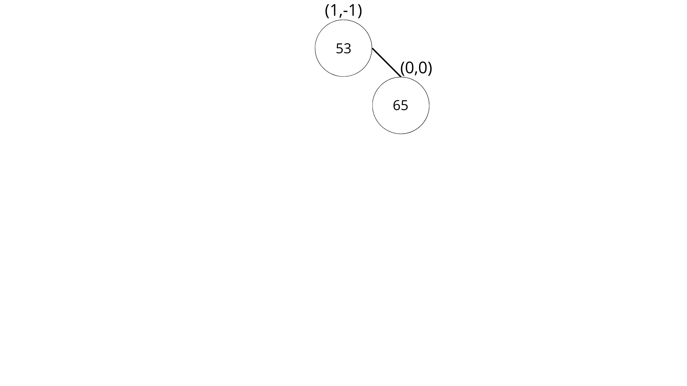

65 is inserted as the right child of 53. BF(53) = –1, still valid.

---

#### Step 3 – Insert 40
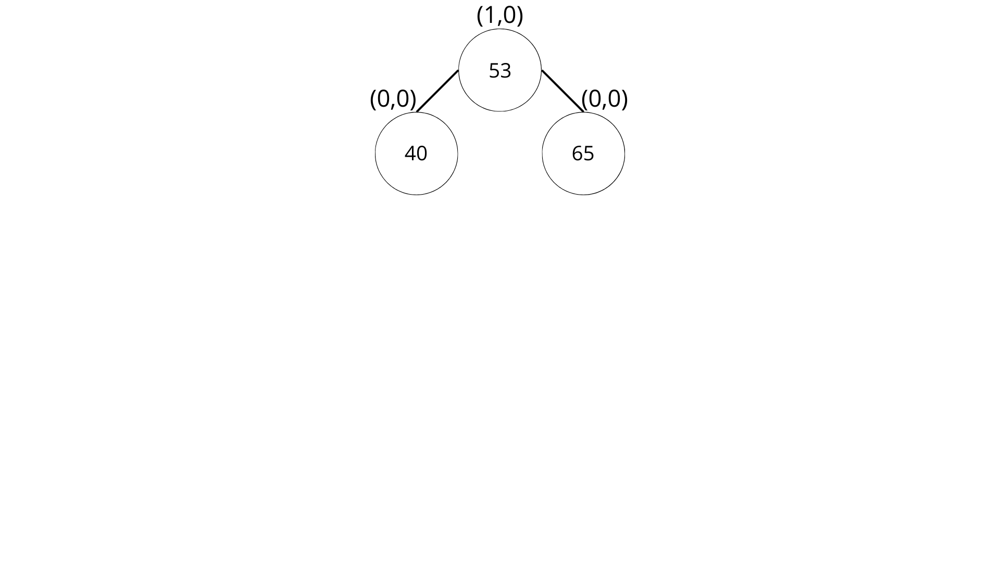

40 is inserted as the left child of 53. BF(53) = 0. Tree remains balanced.

---

#### Step 4 – Insert 79
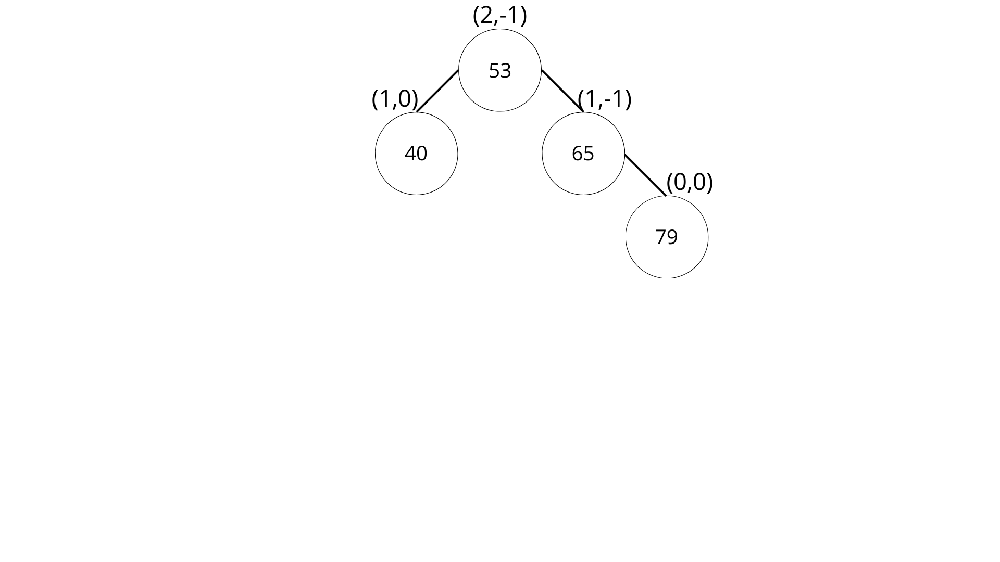

79 is inserted as the right child of 65. All balance factors remain within range.

---

#### Step 5 – Insert 69 (Imbalance occurs)
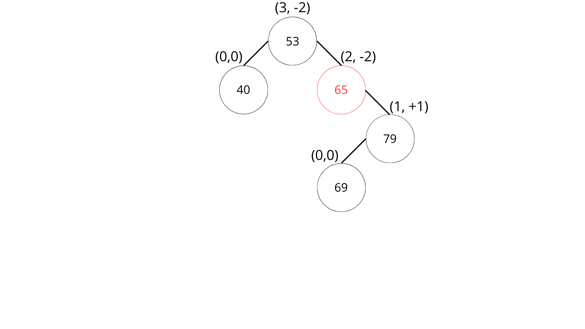

69 is inserted as the left child of 79, causing imbalance at node 65.

**Imbalance type:** Right–Left (RL)  
**Justification:**  
Node 65 becomes right-heavy (BF = –2), but its right child 79 is left-heavy.  
The insertion path goes: right → left.

---

#### Step 6 – RL Rotation
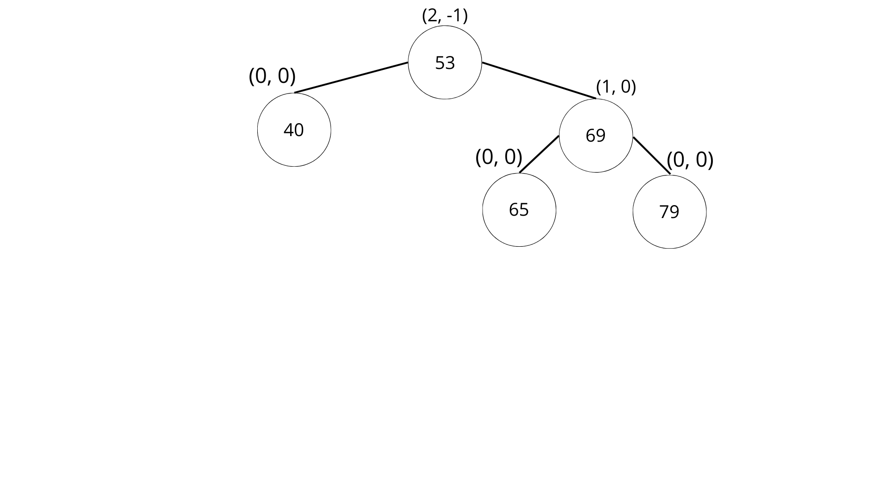

A double rotation is applied (right rotation on 79, then left rotation on 65).  
The subtree becomes balanced.

---

#### Step 7 – Insert 92 (Imbalance occurs)
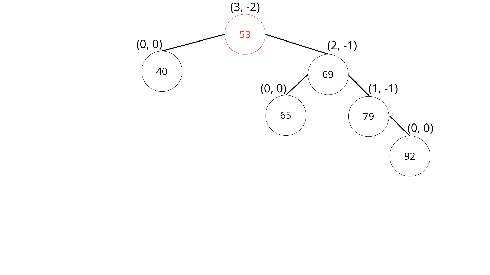

92 is inserted as the right child of 79, causing imbalance at the root 53.

**Imbalance type:** Right–Right (RR)  
**Justification:**  
The insertion path from 53 goes right → right → right.  
Node 53 becomes right-heavy with a right-heavy child.

---

#### Step 8 – RR Rotation
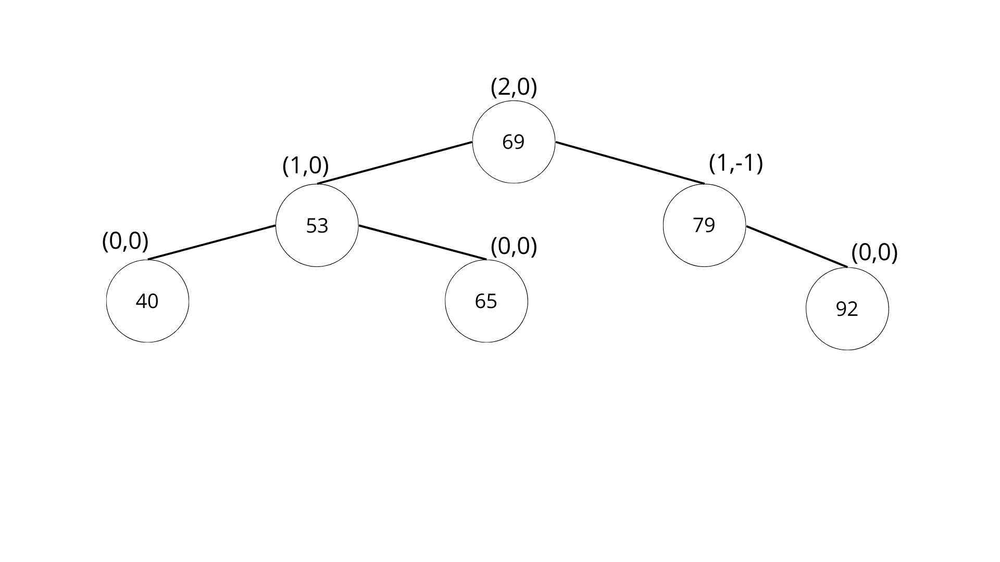

A single left rotation is applied at node 53.  
Node 69 becomes the new root.

---

#### Step 9 – Insert 50
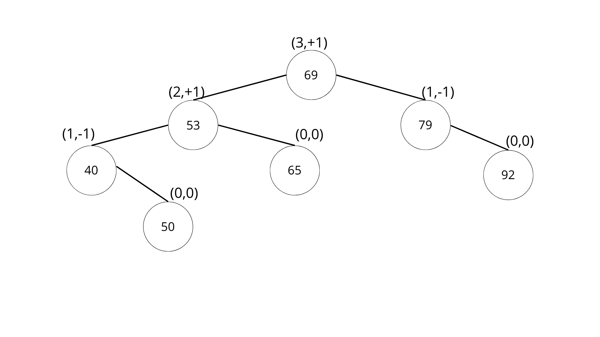

50 is inserted as the right child of 40.  
All balance factors remain valid.

---

#### Step 10 – Insert 30
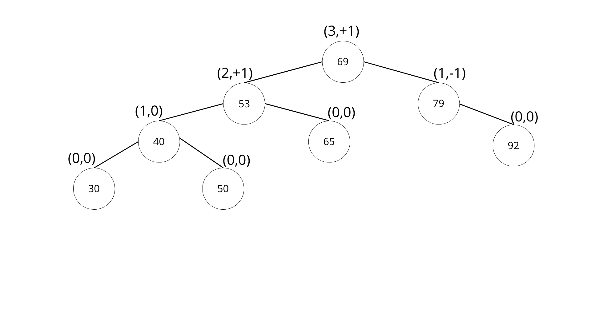

30 is inserted as the left child of 40.  
BF(40) becomes +1, still within limits.  
No imbalance occurs.

---

#### Step 11 – Insert 10 (Imbalance occurs)
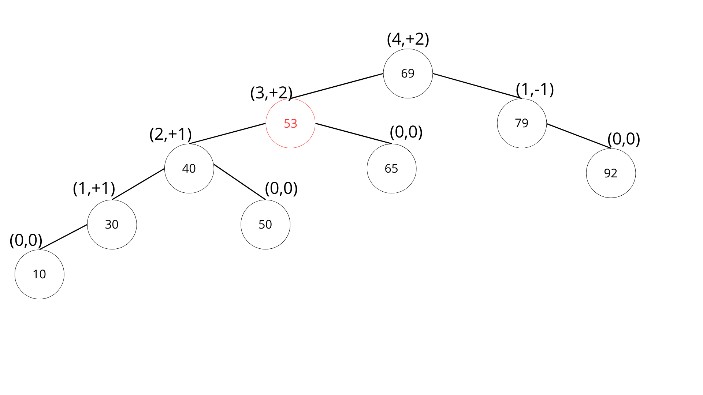

10 is inserted as the left child of 30, causing imbalance at node 53.

**Imbalance type:** Left–Left (LL)  
**Justification:**  
The insertion path goes left → left → left.  
Node 53 becomes left-heavy with a left-heavy child 40.

---

#### Step 12 – LL Rotation
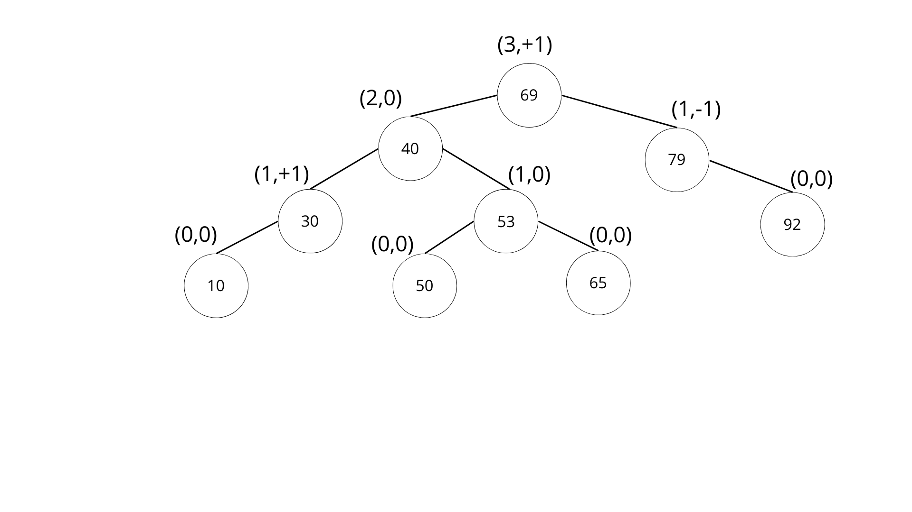

A single right rotation is applied at node 53.  
Heights realign correctly and the tree becomes balanced again.

---

#### Step 13 – Insert 55 (Imbalance occurs)
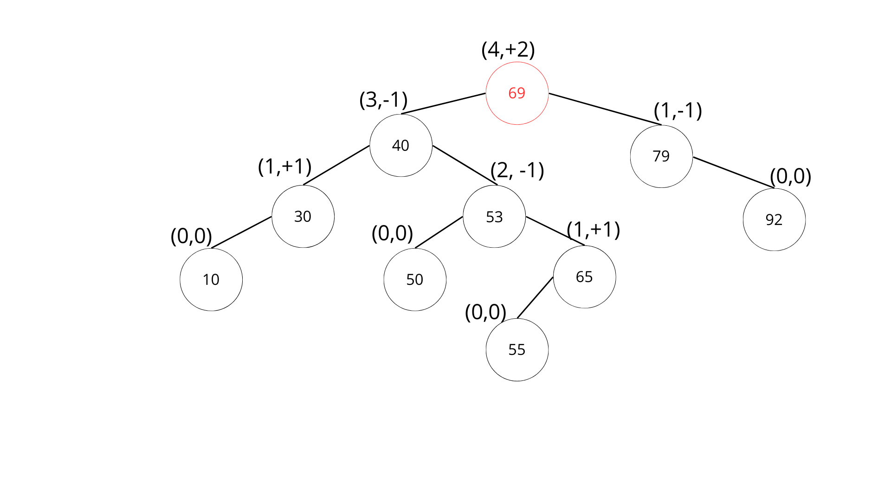

55 is inserted as the left child of 65, causing imbalance at the root 69.

**Imbalance type:** Left–Right (LR)  
**Justification:**  
Node 69 becomes left-heavy (BF = +2),  
but its left subtree (rooted at 53) is right-heavy through 65 → 55.  
Insertion path: left → right.

---

#### Step 14 – LR Rotation
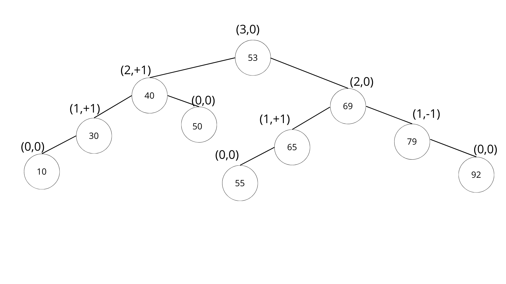

A double rotation corrects the imbalance:  
1. Left rotation under the 53-subtree,  
2. Then right rotation at 69.  

This produces the final balanced AVL tree.


#### In-order traversal and height of final tree

* **In-order traversal** (should be sorted):
  `10, 30, 40, 50, 53, 55, 65, 69, 79, 92`

* **Height of final tree (root)** with leaf = 0:
  `height(53) = 3`