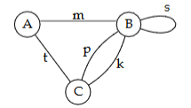
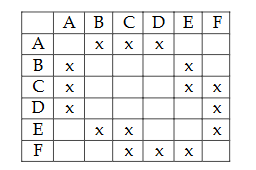
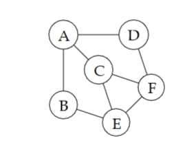

# Graphs

A graph is a structure amounting to a set of objects in which some pairs of the objects are in some sense "related."

The Formal DefinitionA graph $G$ is defined as an ordered pair $G = (V, E)$, where:
- $V$ is a set of Vertices (also called nodes or points).
- $E$ is a set of Edges (also called links or lines), which are pairs of elements from $V$.

Example:

 
## Using the example graph above: 

**(a) give the degree of each node** 
    The degree of a node stands for the number of edges connected to it.

A - 2 (Edges: $m, t$)
B - 5 (Edges: $m, p, k$ and loop $s$ counts twice)
C - 3 (Edges: $t, p, k$)

**(b)  write the vertex set and the edge set** 

Vertex set: $V = \{A, B, C\}$

Edge set: $E = \{m, t, p, k, s\}$ where:
- $m$ connects A and B
- $t$ connects A and C
- $p$ connects B and C
- $k$ connects B and C
- $s$ is a loop on B

**(c)  list all the simple cycles that begin and end with vertex B** 

A simple circle is a path that starts and ends at the same vertex without repeating any edges or vertices (except for the starting/ending vertex)

$B \xrightarrow{s} B$ (The loop)
$B \xrightarrow{p} C \xrightarrow{k} B$ (Using parallel edges)
$B \xrightarrow{m} A \xrightarrow{t} C \xrightarrow{p} B$
$B \xrightarrow{m} A \xrightarrow{t} C \xrightarrow{k} B$(Note: Reversing the direction, e.g., $B-k-C-p-B$, counts as a distinct cycle in directed graphs, but in undirected graphs, they are often considered the same cycle unless specified as a sequence of edges.)

**(d )  list all the simple cycles that begin and end with vertex A** 

$A \xrightarrow{m} B \xrightarrow{p} C \xrightarrow{t} A$
$A \xrightarrow{m} B \xrightarrow{k} C \xrightarrow{t} A$

**(e)  how long is the longest simple path in the graph (i.e. how many edges in the longest path)?** 

A simple path cannot repeat vertices. With only 3 vertices ($A, B, C$), the maximum number of vertices in a simple path is 3, meaning the maximum number of edges is 2.

Example: $A \to B \to C$ (Length: 2 edges).

**(f)  find a path that traverses each *edge* once only** 

- Condition: A graph has an Eulerian path if exactly 0 or 2 vertices have an odd degree. Here, vertices B (degree 5) and C (degree 3) are odd. The path must start at one and end at the other.
- Solution (Start B, End C):$B \xrightarrow{s} B \xrightarrow{m} A \xrightarrow{t} C \xrightarrow{p} B \xrightarrow{k} C$
- Path Sequence: $s, m, t, p, k$.

**(g)  how many answers are there to exercise F?**
There are multiple answers (likely 4 or more distinct edge sequences) because:
- You can start at B and end at C, or start at C and end at B.
- You can traverse the parallel edges ($p$ and $k$) in different orders (e.g., take $k$ first, then $p$).
- You can traverse the loop $s$ at different points in the sequence (as long as you are at node B). 1

## When applied to a graph G(V,E), what is the meaning of each of the following terms

•  **adjacent vertices** - Two vertices are adjacent if they are connected directly by an edge.
•  **connected component** - A connected component is a subgraph in which any two vertices are connected to each other by paths, and which is connected to no additional vertices in the supergraph.
•  **degree of a vertex** - The degree of a vertex is the number of edges connected to it.
•  **spanning sub-graph** - A spanning sub-graph is a subgraph that includes all the vertices of the original graph.
•  **spanning tree** - A spanning subgraph that is also a tree (it is connected and has no cycles). It connects all vertices with the minimum number of edges ($|V| - 1$)5.
•  **path** - A path is a sequence of edges that connects a sequence of vertices.
•  **cycle** - A cycle is a path that starts and ends at the same vertex
•  **simple path** - A simple path is a path that does not repeat any vertices or edges (except for the starting/ending vertex in the case of a cycle).
•  **simple cycle** - A simple cycle is a cycle that does not repeat any vertices or edges (except for the starting/ending vertex).
•  **Eulerian path** - An Eulerian path is a path that traverses each edge exactly once.
•  **Eulerian circuit** - An Eulerian circuit is an Eulerian path that starts and ends at the same vertex.
•  **Hamiltonian path** - A Hamiltonian path is a path that visits each vertex exactly once.
•  **Hamiltonian circuit** - A Hamiltonian circuit is a Hamiltonian path that starts and ends at the same vertex.

## Draw the (undirected) graph given by the following incidence matrix:

## Apply the algorithm for depth-first traversal to the graph built. 
1. Start at node A. 
2. At each node visited, consider the outgoing edges in alphabetical order of the opposite node label.
3. Your answer should show the classification of the edges.

 A -> B -> C -> F -> D 
 Edges {C, A}, {E, F} and {D, A} are back edges, the rest are discovery (tree) edges.

## Apply the algorithm for breadth-first traversal to the graph built. 
1. Start at node A. 
2. At each node visited, consider the outgoing edges in alphabetical order of the opposite node label.
3. Your answer should show the state of the queue, at each step, and the classification of the edges. 

A -> B -> C -> D -> E -> F

The state of the queue at each step is given in the table below. 
Edges {C, E}, {D, F} and {E, F} are cross edges, the rest are discovery (tree) edges.

| Step | Queue State       | Visited Nodes |
|------|-------------------|---------------|
| 1    | [A]               | {A}           |
| 2    | [B, C, D]        | {A, B, C, D}  |
| 3    | [C, D, E]     | {A, B, C, D, E} |
| 4    | [D, E, F]     | {A, B, C, D, E, F} |
| 5    | [E, F]         | {A, B, C, D, E, F} |
| 6    | [F]             | {A, B, C, D, E, F} |
| 7    | []                | {A, B, C, D, E, F} |