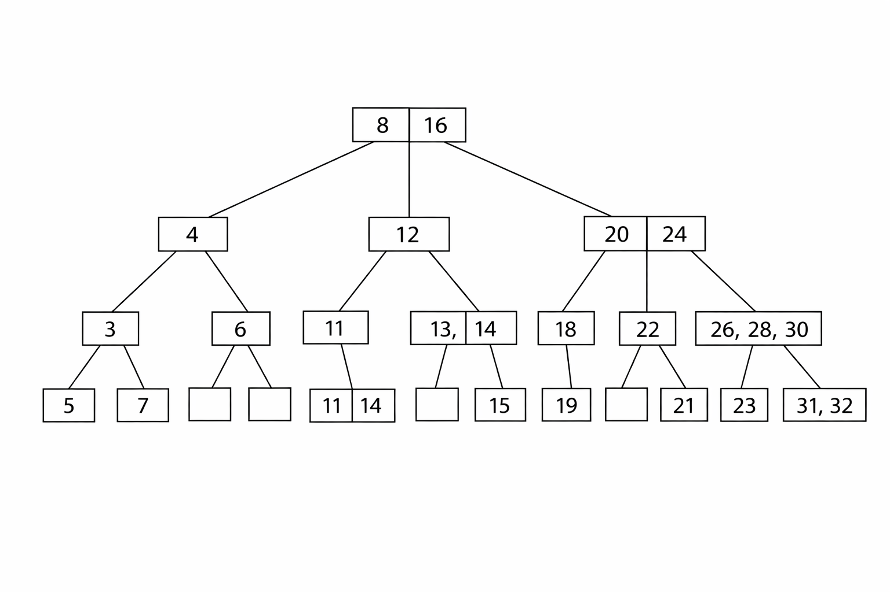

# Multi-way Tree Exercises — Week 11
## 1) Define

### (a) Multi-way tree

A **multi-way tree** is a rooted tree where a node can have **more than two children** (i.e., not restricted to binary). 

### (b) Multi-way search tree

A **multi-way search tree** is a multi-way tree that keeps **keys in sorted order** inside each node, and uses those keys to route searches:

* If a node has keys $(k_1 < k_2 < \dots < k_m)$,
* then it has $(m+1)$ subtrees, where each subtree contains keys in the corresponding key-interval. 

### (c) (2,4) tree

A **(2,4) tree** (aka **2–3–4 tree**) is a balanced multi-way search tree where each internal node has:

* **2 children** (1 key), or
* **3 children** (2 keys), or
* **4 children** (3 keys),

and **all leaves are at the same depth** (perfectly balanced). 

## 2) Construct the (2,4) tree inserting keys 01 to 32

Final (2,4) tree after inserting **01, 02, …, 32** (shown by levels; each bracket is a node’s keys):

**Level 0 (root)**

* `[08, 16]`

**Level 1**

* `[04]`   `[12]`   `[20, 24]`

**Level 2**

* `[02] [06] [10] [14] [18] [22] [26, 28, 30]`

**Level 3 (leaves)**

* `[01] [03] [05] [07] [09] [11] [13] [15] [17] [19] [21] [23] [25] [27] [29] [31, 32]`

(That is a valid 2–3–4 tree: keys sorted in nodes, internal nodes have 2–4 children, and all leaves are aligned.) 

---

## 3) For the tree from Exercise 2

### (a) Height of the tree

* **Height = 3 edges** (root → leaf has 3 links)
* Equivalent: **4 levels** (levels 0,1,2,3)

(If your course defines height as “number of levels”, then it’s **4**.) 

### (b) How many nodes of each degree?

Degree here = **number of children** (so possible degrees are 2, 3, 4; leaves have degree 0).

* Degree **4**: **1** node
* Degree **3**: **2** nodes
* Degree **2**: **8** nodes
* Leaves (degree **0**): **16** nodes

## 4) Delete keys 01 to 10 (one by one), starting from that tree

After deleting **01, 02, …, 10**, the resulting (2,4) tree is:

**Level 0 (root)**

* `[16, 20, 24]`

**Level 1**

* `[12, 14]`   `[18]`   `[22]`   `[26, 28, 30]`

**Level 2 (leaves)**

* `[11] [13] [15] [17] [19] [21] [23] [25] [27] [29] [31, 32]`

(Still balanced: all leaves are on the same level, and node degrees remain valid.) 
