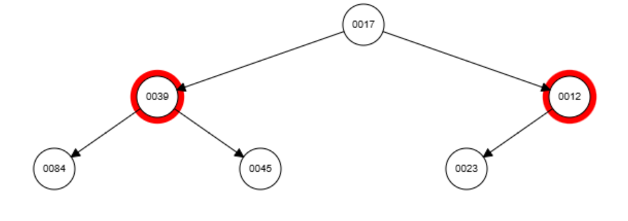
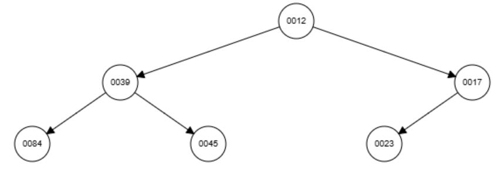

# Priority Queue & Binary Heaps

## 0. Priority Queues
A Priority Queue is a data structure similar to a normal que, except for a crucial diference: the elements are not attended by their arrival order, but for their priority order.

E.g. Hospital line - patients with priority are attended first, even if they got into line after others patients.

### Functionality 
Each item inside the list has a value and a priority.
- To insert: `enqueue` a item with it's priority;
- To remove `dequeue` the item with the biggest priority;
- Check witch item has the biggest priority - `peek`.

### Implementation without Heap

A priority queue can be implemented using a simple list or array in two main ways:

1. **Unordered list:**

   * New elements are inserted at the end in **O(1)** time.
   * To remove the element with highest priority, the entire list must be scanned (**O(n)**).

2. **Ordered list:**

   * Elements are kept sorted by priority.
   * Insertion requires finding the correct position (**O(n)**),
     but removing the highest-priority element is **O(1)**.

Both methods work, but become inefficient for large datasets — that’s why **heaps** are used to achieve **O(log n)** insertion and removal.

## 1. Heap
Implements a priority queue efficiently.

- Structure type: A Binary Heap is a **Complete Binary Tree** (all leves full except possibly the last, filled felt-to-right) with the heap-order property.
- How it’s filled: new entries occupy the next open array cell (next position in level-order).

### The heap-order and positions

| Type | Rule | Result |
| --- | --- | --- |
| **Min-heap** | Every parent ≤ its children | smallest element at root |
| **Max-heap** | Every parent ≥ its children | largest element at root |

> It’s typically stored in an array with children indices `2i+1` and `2i+2` (0-based).

```
   Index:  0   1   2   3   4   5   6
   Array: [10, 15, 20, 30, 40, 50, 60]
```

```
            10 (index 0)
           /           \
     15 (1)             20 (2)
     /     \            /     \
 30 (3)   40 (4)    50 (5)   60 (6)

```

| Node index (i) | Value | Left child index (`2i+1`) | Right child index (`2i+2`) |
| :------------: | :---: | :-----------------------: | :------------------------: |
|        0       |   10  |           1 → 15          |           2 → 20           |
|        1       |   15  |           3 → 30          |           4 → 40           |
|        2       |   20  |           5 → 50          |           6 → 60           |
|        3       |   30  |             —             |              —             |
|        4       |   40  |             —             |              —             |
|        5       |   50  |             —             |              —             |
|        6       |   60  |             —             |              —             |

**P.S.**
* It doesn't matter if the child on the left is smaller or larger than the one on the right.
* It only matter that each parent node is either smaller (in the min-heap) or larger (in the max-heap) than both of its children.

## 2. Build the heap by **inserting**

This is the list we are going to transform in a Heap: `[23, 45, 12, 84, 39, 17, 10]`

Array shows level-order; “swap” lines show the bubble-up.

***bubble-up** - compare with its parent - if the heap order is violated (e.g., child < parent in a min-heap), swap them.

1. Insert **23** → `[23]` (no swaps)
2. Insert **45** → `[23, 45]` (no swaps; 23 ≤ 45)
3. Insert **12** → `[12, 45, 23]` (swap 12 ↑ with 23)
4. Insert **84** → `[12, 45, 23, 84]` (no swaps)
5. Insert **39** → `[12, 39, 23, 84, 45]` (swap 39 ↑ with 45)
6. Insert **17** → `[12, 39, 17, 84, 45, 23]` (swap 17 ↑ with 23)
7. Insert **10** → `[10, 39, 12, 84, 45, 23, 17]` (swap 10 ↑ with 17, then with 12)

**Final heap (after inserts):**
Array (level-order): **[10, 39, 12, 84, 45, 23, 17]**
Tree (by levels):

```
          10
      39      12
    84  45  23  17
```
*Pseudocode*
- Step1: Start from an empty Binary Min Heap.
- Step2: Insert the new node.
- Step3: Compare with it's parent.
- Step4: if new node > parent, swap.
*Repeat

## 3. Remove entries **in key order** (repeated delete-min)

#### In a **heap**, “key” ≠ “index”

* **Key** → is the **value used to order** the heap.
  Example: in a *min-heap of numbers*, the **key** is the number itself.
  If it’s a *heap of objects* (e.g., tasks), the key could be their **priority**.

* **Index** → is simply the **position in the array** where that value is stored.
  It’s only how the heap is **represented in memory**, not what determines its order.

Each removal: take root, move last element to root (last level, node on the right), then bubble-down.

* Remove **10** → heap becomes `[12, 39, 17, 84, 45, 23]` (swap 12↓ with 17 at root)


* Remove **12** → `[17, 39, 23, 84, 45]` (swap 17↓ with 23)
* Remove **17** → `[23, 39, 45, 84]` (swap 23↓ with 45)
* Remove **23** → `[39, 84, 45]` (39 already ≤ children)
* Remove **39** → `[45, 84]`
* Remove **45** → `[84]`
* Remove **84** → `[]`

**Keys removed (ascending):** **10, 12, 17, 23, 39, 45, 84**


## 4. Why worst-case insert/remove is **O(log n)**

The heap’s height **h = ⌊log₂ n⌋** (n = number of nodes) because it’s a complete binary tree (each level multiplies the number of nodes by 2).
| Levels | Nodes total | Height |
| :----: | :---------- | :----- |
|    1   | 1           | 0      |
|    2   | 3           | 1      |
|    3   | 7           | 2      |
|    4   | 15          | 3      |
|    5   | 31          | 4      |


#### 4.1 Insert (bubble-up) → O(log n)

When you insert a new element:

1. You place it at the end of the array (the next free spot).

2. If that value is smaller than its parent, it swaps upward (bubble-up).

3. It can move at most one level per swap, until it reaches the root.

Since the heap has height ≈ log n, the new element might climb up to log n **levels**.

**That’s why the worst case for insertion takes O(log n) swaps/comparisons.**

#### 4.2 Remove (delete-min) → O(log n)

When you remove the root (the smallest value in a min-heap):

1. You take out the root.

2. You move the last element in the array to the root position.

3. That element might be too large for the top — so it must bubble down by swapping with the smaller of its two children, level by level.

Just like bubble-up, it can travel down the height of the tree, which is log n levels.

**Therefore, the worst case for removal is also O(log n).**

## 5. Explain **heapBuild** (Floyd’s method) and show stages for the same data

**heapBuild** (“heapify”) takes an arbitrary complete binary tree (array) and **sifts down** each non-leaf from the last parent to the root (loading many items at once).

Start with the raw array in insertion order / breadth-first (just “placed” left-to-right):
Initial array: `[23, 45, 12, 84, 39, 17, 10]`

bottom-up approach, move from the **last non-leaf** node up to the root: **⌊n/2⌋−1**, this avoid redundant swaps!

* i = **2** (value 12, children 17, 10) → swap with smaller child 10
  After sift-down: **[23, 45, 10, 84, 39, 17, 12]**
* i = **1** (value 45, children 84, 39) → swap with smaller child 39
  After sift-down: **[23, 39, 10, 84, 45, 17, 12]**
* i = **0** (value 23, children 39, 10) → swap with smaller child 10; then compare 23 with children (17, 12) under that spot → swap with 12
  After sift-down: **[10, 39, 12, 84, 45, 17, 23]**

**Final heap (heapBuild):** **[10, 39, 12, 84, 45, 17, 23]**
This builds the heap in **O(n)** time — much faster than inserting one-by-one (which would take O(n log n)).

## 6. Is the heap from (5) the same as from (2)?

**Not necessarily.** Both are valid min-heaps containing the same keys, but different algorithms (incremental inserts vs. bottom-up heapify) can produce different, equally correct shapes/key placements among siblings. In our case:

* From inserts: **[10, 39, 12, 84, 45, 23, 17]**
* From heapBuild: **[10, 39, 12, 84, 45, 17, 23]**

Only the **heap property** matters; heaps are **not unique**.

## 7. Array representations

* From Exercise 2 (inserts): **[10, 39, 12, 84, 45, 23, 17]**
* From Exercise 5 (heapBuild): **[10, 39, 12, 84, 45, 17, 23]**

## 8. Verify the worst-case swaps formula for **heapBuild**

Given the table and the stated equation (max swaps) **= n − h − 1**, with height **h** (edges) of a complete binary tree:

| heap size n | tree height h | max. no. swaps (n − h − 1) |
| ----------: | ------------: | -------------------------: |
|           1 |             0 |                          0 |
|           3 |             1 |                          1 |
|           7 |             2 |                          4 |
|          15 |             3 |                         11 |
|          31 |             4 |                         26 |

These follow directly from substituting h = 0,1,2,3,4 for complete trees of sizes 1,3,7,15,31 respectively.

In a tree of height h, the last h + 1 nodes (the leaves and the last incomplete level) don’t need any swaps, because each of them is already a trivial heap (just one node).

Therefore, the maximum number of nodes that might need to move during heap construction is the total number of nodes minus those “inactive” levels.

## 9. Traversals of the heap from Exercise 2

Use the tree:

```
          10
      39      12
    84  45  23  17
```

* **Pre-order (root, L, R):** **10, 39, 84, 45, 12, 23, 17**
* **Post-order (L, R, root):** **84, 45, 39, 23, 17, 12, 10**
* **In-order (L, root, R):** **84, 39, 45, 10, 23, 12, 17**  *(Note: not sorted; this is a heap, not a BST.)*
* **Breadth-first (level-order):** **10, 39, 12, 84, 45, 23, 17**
