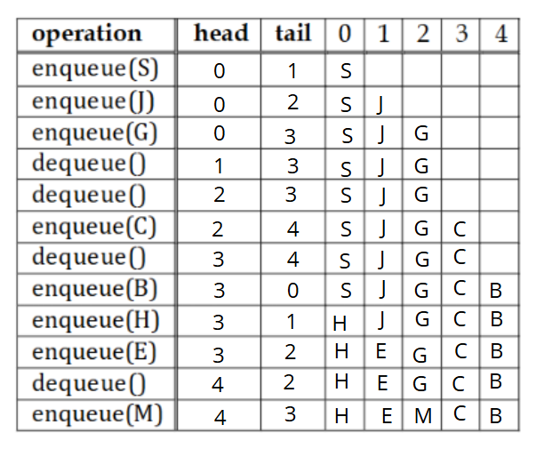
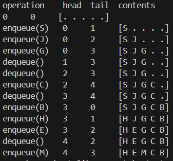

# Queue

### Definition

> The Queue ADT (Abstract Data Type) is a collection that follows the *FIFO principle — First In, First Out*. This means that elements are added to the rear of the queue and removed from the front, preserving the order in which they were inserted.

### Operations

- `enqueue()` - adds an object to the rear (tail) of the queue (returns nothing);
- `dequeue()` - removes and returns the object from the front of the queue;
- `isEmpty()` - checks whether the queue is empty (returns true or false);
- `front()` - returns the object at the front of the queue without removing it;
- `size()` - returns the number of elements currently in the queue.

### Exceptions
An exception is thrown when:

1. Dequeueing or accessing the front of an empty queue - `EmptyQueueException`;
2. Enqueueing into a queue that has reached its maximum capacity - `FullQueueException`;
3. Null element insertion.

### Circular Array

> A circular array is a special kind of array where the end connects back to the beginning (like a loop).

Normally, in a regular array:

```
[ 0 ][ 1 ][ 2 ][ 3 ][ 4 ]
```

When you reach the end (index `4`), you can’t go further.

But in a circular array, if you move forward from the last element,
you go back to the first position:

```
[ 0 ][ 1 ][ 2 ][ 3 ][ 4 ]
   ↑                    ↓
   └────────────────────┘
```

So indexes “wrap around.”


#### Example

Imagine you have a fixed-size array of 5 elements, and you keep adding items:

```
enqueue(1) → [1, _, _, _, _]
enqueue(2) → [1, 2, _, _, _]
enqueue(3) → [1, 2, 3, _, _]
enqueue(4) → [1, 2, 3, 4, _]
enqueue(5) → [1, 2, 3, 4, 5]
```

Now the array is full.
If you remove (dequeue) the first element and add another one:

```
dequeue() → removes 1
enqueue(6)
```

You don’t create a new array — you “wrap around” and insert at the start:

```
[6, 2, 3, 4, 5]
```

The array works in a circle.

#### Circular Array vs. Linked List

**Circular Array**

* Uses **a single, continuous block of memory** (a fixed-size array).
* The size is defined upfront (e.g., `int[] arr = new int[5];`).
* All elements are **stored next to each other** in memory.


```
[ 10 ][ 20 ][ 30 ][ 40 ][ 50 ]
```

When you reach the end, the logic “wraps around” to the start —
but the data still stays in the same memory block.

---

**Linked List**

* Made of **nodes** connected by **pointers (or references)**.
* Can grow or shrink freely (dynamic size).
* Each node points to the next one.


```
[10 | *] → [20 | *] → [30 | *] → [40 | *] → null
```

The nodes can be **scattered in memory** (not contiguous).

---

**Growth and Flexibility**

| Feature                | Circular Array                                  | Linked List                 |
| ---------------------- | ----------------------------------------------- | --------------------------- |
| **Size**               | Fixed                                           | Dynamic                     |
| **Memory Layout**      | Contiguous (one block)                          | Dispersed (nodes linked)    |
| **Insertion/Deletion** | Can be slow if array needs shifting or resizing | Fast (just adjust pointers) |
| **Access by Index**    | Very fast (`O(1)`)                              | Slow (`O(n)`)               |

---

**Circularity**

* In a **circular array**, the “wrap around” is only **logical** — it uses modular arithmetic:

  ```java
  index = (index + 1) % size;
  ```

  So the last position connects back to index `0`.

* In a **circular linked list**, the **last node points back to the first node**:

  ```
  [10 | *] → [20 | *] → [30 | *]
       ↑________________________|
  ```

  This circularity is **done with pointers**, not math.

**Circle Array Example**



> In the circular array implementation of the Queue ADT it is necessary to copy the queue contents
(in the right order) to a larger array when there is an enqueue operation and the queue is already
full.

Algorithm for the copying:

```java
  // Doubles the size of the underlying array
    private void grow() {
        int newCapacity = data.length * 2; // double the current size
        char[] newArray = new char[newCapacity];

        // copy elements in logical order, respecting the circular queue
        for (int i = 0; i < size; i++) {
            newArray[i] = data[(front + i) % data.length];
        }

        data = newArray;
        front = 0;
        rear = size;
    }
```

- Creates a larger array,

- Removes each element from the old queue one by one,

- Puts them in order inside the new array,

- Resets the pointers (head and tail).

> The full implementation can be found on the `CircularArrayQueue.java` file, and the test on the `MainCircularArrayQueue.java`, this is what is expected to be printed on the terminal after the run:


