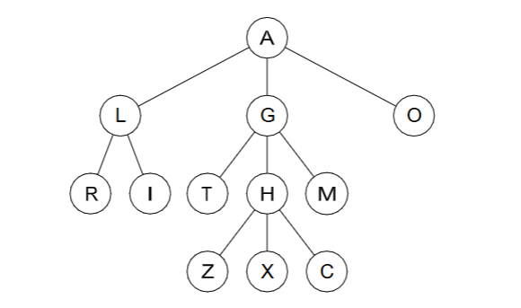
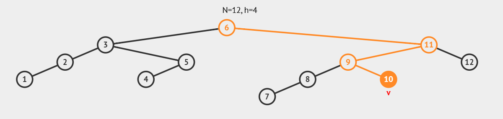
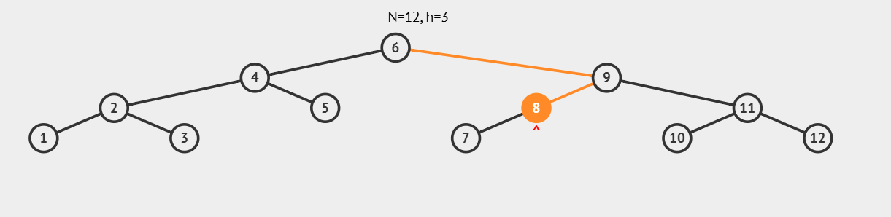
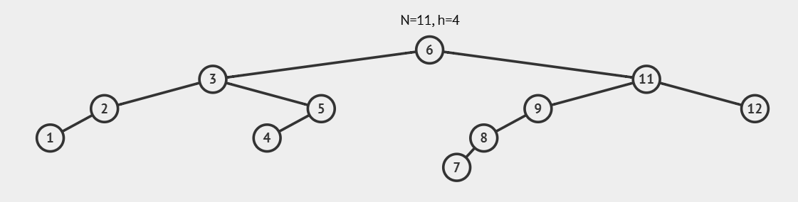
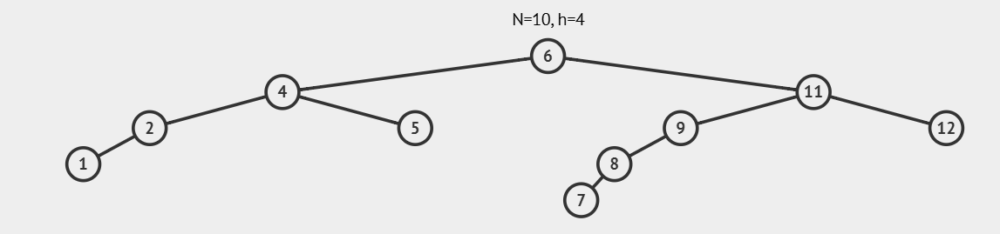

# Tree

## 1. Definitions

**(a) Tree**
A tree is a hierarchical data structure composed of nodes connected by edges.

```
          10
       /   |   \
     5     8    15
    / \        / | \
   2   3     12 14 18

```

**(b) Root**
The root is the entrance node, in other words, it is the most high value in the hierarchy, the node with no parent.

**(c) Leaf**
The leafs are the last nodes presents in the hierarchy, at the bottom, they don't have children.

**(d) Internal node**
Nether a Root nor a Leaf, the internal node is a node placed at the middle of the tree.

**(e) Parent**
The Parent is a node that possesses another node connected at a inferior hierarchy level, the child.

**(f) Child**
The child is a node connected to a node at a superior hierarchy level, the parent.

**(g) Ancestor**
An ancestor is any node placed at a superior hierarchy level comparing to another node.

**(h) Descendent**
An ancestor is any node placed at a inferior hierarchy level comparing to another node.

**(i) Depth (of a node)**
The depth of a node is related to its distance from the root, the number of "hierarchy levels" upon the node in question.

**(j) Height (of a tree)**
The height of a tree is related to its size from the bottom (leafs) up until the top (root)

## 2. For the given tree, list



**(a) the root** - A
**(b) the leaves** - R, I, T, M, Z, X, C, O
**(c) the internal nodes** - L, G, H
**(d) the children of G** - T, H, M
**(e) the descendants of G** - T, H, M, Z, X, C
**(f) the parent of R** - L
**(g) the ancestors of Z** - H, G, A

## 3. Answer the following:
**(a) How many nodes in a tree have no ancestors?**
Only one node, the root.

**(b) What is the name for a node in a tree that has no descendants?**
Leaves.

**(c) Given a particular node N in a tree, how many paths connect the root node to node N?**
The number of edges in that path equals the depth of N.

## 4. For the given tree (above)
**(a) what is the height of the tree?**
3.

**(b) what is the depth of H?**
2.

## 5. For the given tree (above) list the nodes according to the three traversals
**(a) pre-order**
top-down: A, L, R, I, G, T, H, Z, X, C, M, O 
> Root → Children (from left to right).

**(b) post-order**
bottom-up: R, I, L, T, Z, X, C, H, M, G, O, A
> Children (from left to right) → Root

**(c) breadth first**
wide: A, L, G, O, R, I, T, H, M, Z, X, C
> Level-Order: level by level, from top to bottom, and left to right within each level.

**(d) depth-first**
deep: A, L, R, I, G, T, H, Z, X, C, M, O 
> Go as deep as possible down one branch of the tree before backtracking.

## 6. Define the following terms
**(a) Binary tree**
A Binary Tree is a particular type of tree that each node have at most 2 children.

```
          10
         /  \
        7    20
       /    /  \
      4    15   25

```
No value rule — 15 < 20 but 7 < 10 doesn’t matter here.

**(b) Binary search tree**
A Binary Search Tree (BST) is a type of binary tree that respect a specific type of node organization. Beyonds only having nodes with at most two children, the nodes are organized in a way that all values in the left subtree are smaller, and all values in the right subtree are larger than the node’s value.

```
          10
         /  \
        5    15
       / \     \
      2   7     20
```

**(c) Full binary tree**
A Full Binary Tree happens when all nodes at all layers have either none or two children. No node has only one child.

```
          1
         / \
        2   3
           / \
          4   5

```

**(d) Proper binary tree**
A proper binary tree (also called a strict or full binary tree) is a tree in which every internal node has exactly two children.

```
           10
          /  \
         6    14
        / \  / \
       3  8 12 16

```

**(e) Depth (of a node)**
The depth of a node is the number of edges from the root to that node.

**(f) Height (of a tree)**
The height of a tree is the number of edges on the longest path from the root to a leaf.

**(g) AVL TREE**
AVL trees were invented to keep BSTs balanced automatically after every insertion or deletion.

The heigh diference between its left and right subtrees must be at most 1.

> balance_factor = height(left subtree) - height(right subtree)

### 7. Show:

**(a) The BST that results from inserting the sequence 6, 3, 11, 9, 8, 5, 4, 2, 12, 7, 1, 10 of keys into an initially empty tree.**



**(b) The AVL tree that results from inserting the sequence 6, 3, 11, 9, 8, 5, 4, 2, 12, 7, 1, 10 of keys into an initially empty tree.**



## 8. Give the in-order traversal of the nodes for the tree that you obtained from exercise 7(a).
| Left → Root → Right

1, 2, 3, 4, 5, 6, 7, 8, 9, 10, 11, 12.

Because it’s a BST, the in-order traversal always returns the nodes in ascending (sorted) order.

## 9. What tree results from deleting key 10 from the tree that you obtained from exercise 7(a)?

> Deleting Process: CASE 1 - The node is a leaf 



## 10. What tree results from deleting key 3 from the tree that you obtained from exercise 7(a)?

> Deleting Process: CASE 3 - The node has TWO children


1. Find the next node in order (smallest value in the right subtree).
2. Replace the target node’s value with that node’s value.
3. Then delete that duplicate node. 

## 11. Investigate the relationship between the number of nodes in a full binary tree and the height of the tree.
**(a) How many nodes are there in a full tree of height 0, height 1, etc.?**
- **Make a table with two columns, headed h for height and n for number of nodes, and complete the entries for h from 0 to 10.**

| h | n |
|:--:|:--:|
| 0 |  1 |
| 1 | 3  |
| 2 | 7  |
| 3 |  15 |
| 4 | 31  |
| 5 |  63 |
| 6 |  127 |
| 7 | 225  |
| 8 | 511  |
| 9 | 1023  |
| 10 | 2047 |

For a full binary tree:

```math
   n = 2^{(h + 1)} - 1
```

---
 **Meaning:**
- `h` → height of the tree (number of edges on the longest path from root to leaf)  
- `n` → total number of nodes  

So:
- When `h = 0` → `n = 1`
- When `h = 1` → `n = 3`
- When `h = 2` → `n = 7`  
…and so on, doubling each time.


**(b) In going from one row to the next, what is the increase in the value of n? Add a third column to your table to show the increments of n.**

| h | n | Δn (increase in n)
|:--:|:--:|:--:|
| 0 |  1 | 0 |
| 1 | 3  | 2 |
| 2 | 7  | 3 |
| 3 |  15 | 8 |
| 4 | 31  | 16 |
| 5 |  63 | 32 |
| 6 |  127 | 64 |
| 7 | 225  | 98 |
| 8 | 511  | 286 |
| 9 | 1023  | 512 |
| 10 | 2047 | 1024 |

**Increment formula:**
```math
   Δn=2h
```

**(c) What is the relation between the values of n and the values of the increments?**
Each time you grow the tree one level, the new level (Δn) has half as many nodes as all the nodes that existed before plus one.

The total number of nodes (n) is twice the number of new nodes added at the last level, minus 1.


**(d) Argue that n = 2(h+1) − 1 for all values of h.**

In a **full binary tree**, each level doubles the number of nodes compared to the previous level.

* The **first level (the root)** has 1 node.
* The **second level** has 2 nodes.
* The **third level** has 4 nodes.
* The **fourth level** has 8 nodes.
  …and so on, until the last level.

So, the total number of nodes in the tree is:
1 + 2 + 4 + 8 + … + 2^h

This is a **geometric sequence**, and when you add it all up, it gives the formula:
→ **n = 2^(h+1) − 1**

In simpler terms:

> Each new level doubles the nodes, and when you add up all those levels, the total always follows that pattern — it works for every possible height h.

**(e) Argue that h = O(log n)**

The formula from before was:
**n = 2^(h+1) − 1**

If you think in reverse, to find how tall (h) a tree is based on how many nodes (n) it has, you can rearrange the formula — that gives something like:
**h ≈ log₂(n)**

That means the **height grows much slower** than the number of nodes.

So when the number of nodes **doubles**, the height only increases by **1**.

In other words:

> The height of a full binary tree increases *logarithmically* with the number of nodes — that’s why we say **h = O(log n)**.

## 12. Show me the code!

`AVLNode.java`
Implementes the nodes

`AVLTree.java`

`AVLTreeTest.java`

Think how you could implement these without recursion.

(b) Investigate the insert method. Work through some examples trees, perhaps using the VisuAlgo website, to ensure you understand why it is correct.

(c) Read the rotateWithLeftChild and rotateWithRightChild methods and count the number of links changed by their implementation; what is their complexity (O(. . .))?

## 13. Investigate the run time performance in AVL trees for

**(a) search**

**(b) insertion**

**(c) deletion and explain why they are all O(log n).**
