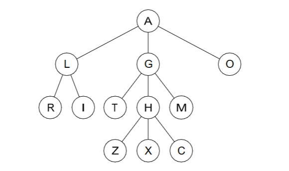

# Tree

## Definitions

**(a) Tree**
A tree is a hierarchical data structure composed of nodes connected by edges.

```
          10
       /   |   \
     5     8    15
    / \        / | \
   2   3     12 14 18

```

**(b) Root**
The root is the entrance node, in other words, it is the most high value in the hierarchy, the node with no parent.

**(c) Leaf**
The leafs are the last nodes presents in the hierarchy, at the bottom, they don't have children.

**(d) Internal node**
Nether a Root nor a Leaf, the internal node is a node placed at the middle of the tree.

**(e) Parent**
The Parent is a node that possesses another node connected at a inferior hierarchy level, the child.

**(f) Child**
The child is a node connected to a node at a superior hierarchy level, the parent.

**(g) Ancestor**
An ancestor is any node placed at a superior hierarchy level comparing to another node.

**(h) Descendent**
An ancestor is any node placed at a inferior hierarchy level comparing to another node.

**(i) Depth (of a node)**
The depth of a node is related to its distance from the root, the number of "hierarchy levels" upon the node in question.

**(j) Height (of a tree)**
The height of a tree is related to its size from the bottom (leafs) up until the top (root)

## Example



###  For the given tree (above) list
**(a) the root** - A
**(b) the leaves** - R, I, T, M, Z, X, C, O
**(c) the internal nodes** - L, G, H
**(d) the children of G** - T, H, M
**(e) the descendants of G** - T, H, M, Z, X, C
**(f) the parent of R** - L
**(g) the ancestors of Z** - H, G, A

### Answer the following:
**(a) How many nodes in a tree have no ancestors?**
Only one node, the root.

**(b) What is the name for a node in a tree that has no descendants?**
Leaves.

**(c) Given a particular node N in a tree, how many paths connect the root node to node N?**
The number of edges in that path equals the depth of N.

### For the given tree (above)
**(a) what is the height of the tree?**
3.

**(b) what is the depth of H?**
2.

### For the given tree (above) list the nodes according to the three traversals
**(a) pre-order**
top-down: A, L, R, I, G, T, H, Z, X, C, M, O 
> Root → Children (from left to right).

**(b) post-order**
bottom-up: R, I, L, T, Z, X, C, H, M, G, O, A
> Children (from left to right) → Root

**(c) breadth first**
wide: A, L, G, O, R, I, T, H, M, Z, X, C
> Level-Order: level by level, from top to bottom, and left to right within each level.

**(d) depth-first**
deep: A, L, R, I, G, T, H, Z, X, C, M, O 
> Go as deep as possible down one branch of the tree before backtracking.

### Define the following terms.
**(a) Binary tree**
A Binary Tree is a particular type of tree that each node have at most 2 children.

```
          10
         /  \
        7    20
       /    /  \
      4    15   25

```
No value rule — 15 < 20 but 7 < 10 doesn’t matter here.

**(b) Binary search tree**
A Binary Search Tree (BST) is a type of binary tree that respect a specific type of node organization. Beyonds only having nodes with at most two children, the nodes are organized in a way that all values in the left subtree are smaller, and all values in the right subtree are larger than the node’s value.

```
          10
         /  \
        5    15
       / \     \
      2   7     20
```

**(c) Full binary tree**
A Full Binary Tree happens when all nodes at all layers have either none or two children. No node has only one child.

```
          1
         / \
        2   3
           / \
          4   5

```

**(d) Proper binary tree**
A proper binary tree (also called a strict or full binary tree) is a tree in which every internal node has exactly two children.

```
           10
          /  \
         6    14
        / \  / \
       3  8 12 16

```

**(e) Depth (of a node)**
The depth of a node is the number of edges from the root to that node.

**(f) Height (of a tree)**
The height of a tree is the number of edges on the longest path from the root to a leaf.